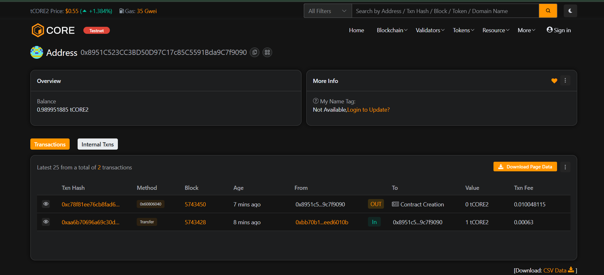

📜 Blockchain Document Notary

A decentralized notary system that leverages blockchain technology to validate the existence of documents without revealing their contents.

---

## 🧠 Overview

**Blockchain Document Notary** is a smart contract-based application that allows users to submit the hash of a document. The system securely records and timestamps the hash on the blockchain, providing proof of existence and authorship. This ensures that the document hasn’t been tampered with and existed at a specific point in time.

---

## 🚀 Features

- 🔐 **Secure Hash Storage** – Store SHA256 hash of any file without uploading its content.
- ⏱️ **Timestamped Proof** – Record the exact time when a document was notarized.
- 🧾 **Public Verification** – Anyone can verify the authenticity and ownership of a file.
- 💡 **Simple Interface** – Easily interact with the contract via Remix or custom UI.

---

## 🛠️ Technologies Used

- **Solidity** – Smart contract language.
- **Remix IDE** – Development and deployment environment.
- **Core Blockchain Testnet2** – Deployment platform.
- **MetaMask** – Wallet for interaction.
- **JavaScript (Frontend, optional)** – For client-side hash generation.

---

## 📁 Contract Address
0x8951C523CC3BD50D97C17c85C5591Bda9C7f9090

## 📸 Transaction Screenshot

